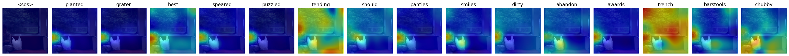

# Controllable Image Captioning with CNN-Transformer Architecture

An end-to-end controllable image captioning model built with an **Encoder-Attention-Transformer Decoder** pipeline in PyTorch. The model extracts image feature maps via a CNN backbone (ResNet-style), projects spatial tokens into a latent space, and conditions an autoregressive Transformer decoder alongside length control prompt tokens (`<short>`, `<medium>`, `<long>`).

Developed as part of the *Deep Network Development* course at Eötvös Loránd University (ELTE).

---

## Architecture Overview

```
                        +----------------------------+
                        |      Input RGB Image       |
                        +--------------+-------------+
                                       |
                                       v
                        +----------------------------+
                        |    Pre-trained CNN (ResNet)|
                        |   Visual Feature Extractor |
                        +--------------+-------------+
                                       |
                                       v
                        +----------------------------+
                        |  Linear Projection & Norm  |
                        +--------------+-------------+
                                       |
                   +-------------------+-------------------+
                   | [Spatial Image Feature Embeddings]     |
                   +-------------------+-------------------+
                                       | (Memory Key/Value)
                                       v
+-------------------+   +----------------------------+   +-------------------+
| Length Token      |-->|  Autogressive Transformer  |<--| Shifted Caption   |
| (<short/med/long>)|   |       Decoder Blocks       |   | Tokens (Target)   |
+-------------------+   |   (Self-Attn + Cross-Attn) |   +-------------------+
                        +--------------+-------------+
                                       |
                                       v
                        +----------------------------+
                        |  Vocabulary Output Head    |
                        |      (Linear + Softmax)    |
                        +--------------+-------------+
                                       |
                                       v
                        +----------------------------+
                        |      Generated Caption     |
                        +----------------------------+

```

1. **Visual Feature Encoder:** Uses a pre-trained CNN to downsample inputs into a spatial feature grid ($B \times D \times H \times W$), projecting spatial positions into Transformer hidden dimension $d_{\text{model}}$.
2. **Length-Control Token Conditioning:** Captions are dynamically categorized during batch creation and prefixed with length-specific control tokens:
* `<short>`: Token lengths $< 8$
* `<medium>`: Token lengths $8$ to $12$
* `<long>`: Token lengths $\ge 13$


3. **Transformer Decoder:** Standard multi-head self-attention and cross-attention blocks with sinusoidal positional encodings to predict the next word token iteratively.
4. **Cross-Attention Heatmaps:** Attention weights from the decoder-to-image cross-attention heads are retained during generation to render spatial focus maps over the input image per decoded token.

---

## Dataset & Preprocessing

* **Dataset:** [MS COCO Captions 2017](https://www.google.com/search?q=https://cocodataset.org/%23download) (Subsampled to 40,000 train images and 5,000 validation images for consumer hardware feasibility).
* **Transforms:**
* **Train:** `Resize(256)`, `RandomCrop(224)`, `RandomHorizontalFlip(0.5)`, `ColorJitter`, `Normalize` (ImageNet statistics).
* **Val:** `Resize(256)`, `CenterCrop(224)`, `Normalize`.


* **Vocabulary:** Built using `nltk.tokenize.word_tokenize` with a minimum word frequency threshold (`freq_threshold = 5`). Includes special tokens `<pad>`, `<sos>`, `<eos>`, `<unk>`, `<short>`, `<medium>`, `<long>`.

---

## Project Structure

```text
.
├── image_captioning.ipynb        # Complete implementation notebook
├── heatmaps/                     # Sample cross-attention heatmaps
│   ├── attention_sample_1.png
│   └── ...
├── .gitignore                    # Excludes datasets, checkpoints, raw JSONs
└── README.md

```

---

## Training Setup & Constraints

* **Hardware:** Local training on NVIDIA GeForce RTX 5070 GPU (8 GB VRAM).
* **Batch Size:** 32 (with dynamic padding and mask generation via custom `collate_fn`).
* **Optimizer:** Adam / AdamW with Cross-Entropy Loss (ignoring index for `<pad>` token).
* **Training Schedule:** Fast convergence verification (~5 epochs on training subset under 1 hour execution budget).

---

## Observed Performance & Failure Analysis

Running a sequence-to-sequence Transformer decoder trained from scratch on an 8 GB consumer GPU within tight training time constraints highlights standard autoregressive failure modes:

### 1. Repetitive Word Generation (Degenerate Greedy Decoding)

* **Symptom:** During inference, greedy decoding tends to get stuck in local sequence loops, frequently predicting repetitive phrases (e.g., `"a person standing in a room with a..."` or repeating common articles/nouns) across visually distinct images.
* **Root Causes:**
* **Cold-Start Decoder:** The Transformer decoder weights and token embeddings were trained entirely from scratch rather than initialized from a pre-trained language model checkpoint (e.g., GPT-2, DistilGPT2).
* **Exposure Bias & Greedy Search:** Exposure bias during teacher-forced training causes single token prediction errors to compound rapidly at inference time when using naive greedy argmax sampling without repetition penalties.
* **Optimization Horizon:** A brief 5-epoch training session on a 40k subset is insufficient for cross-attention layers to disentangle fine-grained spatial image regions from sequence-level language priors.


### 2. Failure Analysis Matrix

| Issue Observed | Contributing Factor | Engineering Solution |
| --- | --- | --- |
| Vocabulary / Mode Collapse | Small training subset & language prior bias | Train on full COCO dataset; initialize token embeddings from pre-trained weights (GloVe / BERT / GPT-2). |
| Looping Token Predictions | Greedy argmax decoding | Implement **Beam Search** ($K=3\text{--}5$) with length normalization and explicit $n$-gram repetition penalties ($p=1.2$). |
| Blurry Cross-Attention Focus | Encoder spatial resolution bottlenecks ($7 \times 7$) | Fine-tune higher-resolution convolutional stages (e.g., ResNet layer4) or swap to Vision Transformer (ViT / Swin) patch tokens. |
| Over-general captions | Weak visual-language alignment | Switch loss from standard cross-entropy to **SCST (Self-Critical Sequence Training)** using RL reward optimization over CIDEr/BLEU. |

---

## Sample Attention Visualizations

The model exposes cross-attention weights between generated text tokens and the $H \times W$ encoder feature map.

```markdown

*Figure: Spatial cross-attention distribution across decoded words for a validation sample.*

```

---

## Getting Started

### 1. Requirements

Install required dependencies:

```bash
pip install torch torchvision nltk pycocotools matplotlib numpy pillow

```

### 2. Dataset Download

Download and extract the MS COCO 2017 dataset into a local directory:

```bash
mkdir -p coco/images coco/annotations
cd coco

# Download images
wget http://images.cocodataset.org/zips/train2017.zip && unzip train2017.zip -d images/
wget http://images.cocodataset.org/zips/val2017.zip && unzip val2017.zip -d images/

# Download annotations
wget http://images.cocodataset.org/annotations/annotations_trainval2017.zip && unzip annotations_trainval2017.zip

```

### 3. Run Notebook

Launch Jupyter and open `image_captioning.ipynb`:

```bash
jupyter notebook image_captioning.ipynb

```

---

## Future Improvements

* [ ] Implement **Beam Search** decoding with temperature tuning and top-$k$ / top-$p$ nucleus sampling.
* [ ] Upgrade the encoder backbone to a Vision Transformer (ViT-B/16) or pre-trained CLIP vision tower.
* [ ] Evaluate against pre-trained zero-shot vision-language baselines (BLIP, ViT-GPT2) using BLEU-1 to BLEU-4, ROUGE-L, and CIDEr metrics.
* [ ] Add reinforcement learning fine-tuning (CIDEr-D optimization via SCST).
